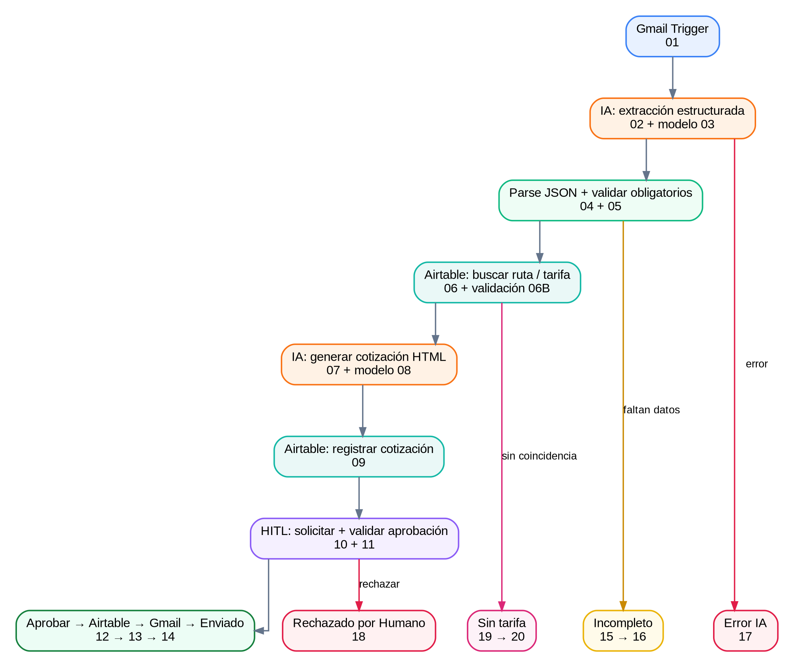
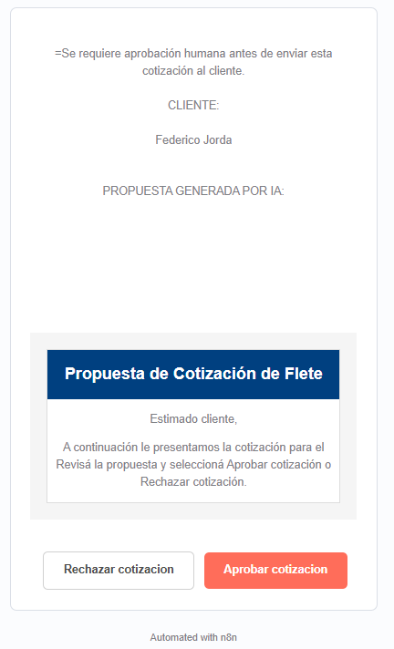
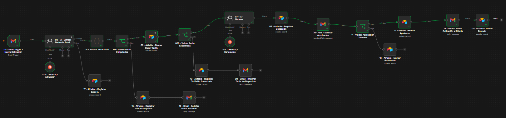
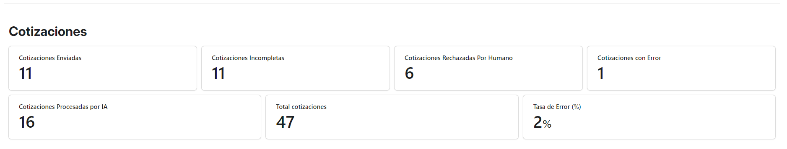
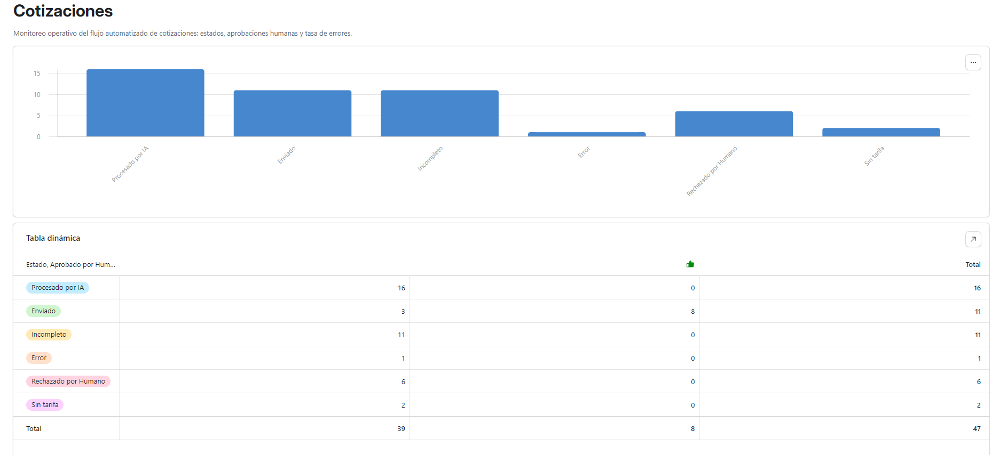

# Ecosistema IA - Cotizaciones Logísticas Automatizadas

Proyecto final de automatización orientado a la gestión de cotizaciones logísticas por email. El sistema recibe solicitudes en Gmail, extrae datos con IA, valida campos obligatorios, consulta tarifas en Airtable, genera una propuesta, solicita aprobación humana y recién después responde al cliente.

## Objetivo

Reducir el trabajo manual en el proceso de cotización sin perder control humano sobre acciones comerciales críticas. La solución combina automatización, memoria estructurada, IA generativa, manejo de errores y una instancia HITL (Human in the Loop).

## Arquitectura



Flujo principal:

`Gmail -> IA extracción -> Parseo JSON -> Validación -> Airtable tarifas -> IA cotización -> Airtable registro -> HITL -> Gmail cliente -> Airtable estado final`

Ramas alternativas:

- Datos incompletos -> registra `Incompleto` y solicita la información faltante.
- Tarifa no encontrada -> registra `Sin tarifa` y avisa al cliente que el caso queda para revisión.
- Error de IA -> registra `Error` en Airtable.
- Rechazo humano -> registra `Rechazado por Humano` y no contacta al cliente.

## Stack tecnológico

- **n8n:** orquestación del workflow.
- **Gmail:** entrada, aprobación humana y salida al cliente.
- **Airtable:** memoria persistente, tarifas, estados, trazabilidad y dashboard. Base: **Cotizaciones Logísticas IA**.
- **Groq:** proveedor de inferencia.
- **OpenAI GPT-OSS 120B:** modelo utilizado para extracción y generación a través de Groq.

## Modelo de IA

El workflow utiliza el mismo modelo con dos límites distintos según la tarea:

- Extracción estructurada: `openai/gpt-oss-120b`, máximo 300 tokens.
- Generación de cotización: `openai/gpt-oss-120b`, máximo 1000 tokens.

El prompt de extracción devuelve únicamente JSON y normaliza `tipo_carga` a uno de cuatro valores: `General`, `Frágil`, `Refrigerada` o `Peligrosa`.

El prompt comercial prohíbe inventar precios, rutas, tiempos, condiciones y datos de contacto. La respuesta se genera en HTML y siempre pasa por aprobación humana antes de enviarse.

## Estructura de datos

### Tabla `Rutas_Tarifas`

Campos principales:

- Origen
- Destino
- Tipo de carga
- Precio base
- Tiempo estimado
- Cotizaciones relacionadas

### Tabla `Cotizaciones`

Campos principales:

- Id
- Ruta
- Cliente Email
- Peso (kg)
- Estado
- Texto Generado IA
- Aprobado por Humano
- Message-ID Original
- Asunto Original
- Mensaje Original
- Detalle Error
- Timestamp
- Indicador Error

Estados contemplados: `Pendiente`, `Procesado por IA`, `Aprobado por Humano`, `Enviado`, `Incompleto`, `Error`, `Rechazado por Humano` y `Sin tarifa`.

## Ejemplo de JSON de extracción

```json
{
  "origen": "CABA",
  "destino": "Buenos Aires",
  "tipo_carga": "Frágil",
  "peso_kg": 2000,
  "urgencia": null
}
```

## Human in the Loop

La propuesta generada no se envía automáticamente. n8n envía una solicitud de aprobación y espera una decisión humana:

```json
{
  "data": {
    "approved": true
  }
}
```

- `true`: actualiza Airtable, envía al cliente y marca `Enviado`.
- `false`: marca `Rechazado por Humano` y finaliza sin envío al cliente.



## Resiliencia

El flujo contempla:

- validación de origen, destino, peso y tipo de carga;
- salida de error específica del agente de extracción;
- búsqueda de tarifas con resultado vacío controlado mediante `Always Output Data`;
- IF específico para distinguir tarifa encontrada/no encontrada;
- registro de datos incompletos;
- registro de solicitudes sin tarifa;
- registro de errores de IA;
- filtro anti-loop en Gmail;
- trazabilidad mediante Message-ID/Thread ID y estados persistentes;
- aprobación humana antes de una acción comercial externa.

## Workflow final

La siguiente captura muestra una ejecución exitosa end-to-end por la rama principal. Las ramas alternativas permanecen visibles en el mismo flujo.



## Dashboard y observabilidad

El Dashboard de Airtable permite monitorear volumen, estados, aprobaciones humanas y tasa de error.

Snapshot final de pruebas: **47 registros**; **16 procesados por IA, 11 enviados, 11 incompletos, 6 rechazados por humano, 2 sin tarifa y 1 error**. La tasa de error observada en el Dashboard es **2%**.





## Evidencias incluidas

- `evidencias/arquitectura.png`: diagrama general del ecosistema.
- `evidencias/workflow_final.png`: ejecución exitosa end-to-end del workflow final.
- `evidencias/hitl_aprobacion.png`: aprobación humana previa al envío.
- `evidencias/dashboard_kpis.png`: KPIs operativos finales.
- `evidencias/dashboard_estados.png`: distribución por estado y tabla dinámica.
- `evidencias/rama_validacion_tarifa.png`: validación de tarifa encontrada/no encontrada.
- `evidencias/caso_sin_tarifa_airtable.png`: configuración del registro `Sin tarifa`.

## Pruebas funcionales

| Caso | Entrada | Resultado esperado |
|---|---|---|
| T01 | Datos completos + tarifa + aprobación | Email enviado y estado `Enviado` |
| T02 | Datos completos + tarifa + rechazo | Estado `Rechazado por Humano`, sin email al cliente |
| T03 | Falta un dato obligatorio | Estado `Incompleto` y solicitud de datos |
| T04 | Ruta/tipo sin tarifa | Estado `Sin tarifa` y aviso al cliente |
| T05 | Falla del agente de extracción | Estado `Error` |

## Seguridad

- Las credenciales se gestionan desde el almacén de credenciales de n8n.
- No se deben versionar API keys, tokens OAuth ni secretos en GitHub.
- El LLM recibe solo la información necesaria para la cotización.
- La generación comercial está limitada por prompt y por HITL.
- Las vistas públicas de Airtable ocultan campos sensibles del cliente y datos internos que no son necesarios para evaluar el proyecto.
- Para producción, emails y otros parámetros de entorno deberían externalizarse como variables/configuración.


## Video demostrativo

- **Prueba de funcionamiento del workflow (~3 minutos):** https://drive.google.com/file/d/11NXf5_6JSJrCwBJpN4fOGFp6ss53nOmD/view?usp=sharing

El video recorre el workflow en n8n, la validación de datos, las ramas alternativas, el HITL, la memoria en Airtable y el Dashboard operativo.

## Archivos de entrega

- [PDF final](docs/Entrega_Final_Ecosistema_IA_Federico_Jorda.pdf)
- [Workflow n8n](workflow/Ecosistema_IA_Cotizaciones_Logisticas.json)

## Repositorio público

- **GitHub:** https://github.com/fedejorda/ecosistema-ia-cotizaciones-logisticas

## Enlaces públicos de Airtable

- **Dashboard operativo:** https://airtable.com/appfVcP7wF1EQ4pQk/shrq91E0H9vKtkBda
- **Memoria operativa - Cotizaciones (solo lectura):** https://airtable.com/appfVcP7wF1EQ4pQk/shrzMCq7bi7jI4RPs
- **Fuente de verdad - Rutas y tarifas (solo lectura):** https://airtable.com/appfVcP7wF1EQ4pQk/shrLNbo9ZgwVCs1Tn

## Cómo importar el workflow

1. Abrir n8n.
2. Elegir **Import from File**.
3. Seleccionar `workflow/Ecosistema_IA_Cotizaciones_Logisticas.json`.
4. Reasignar las credenciales de Gmail, Airtable y Groq en el entorno destino.
5. Verificar IDs/base/tablas y parámetros operativos antes de activar.

## Autor

**Federico Jorda**  
Supervisor de ruteo
